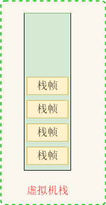
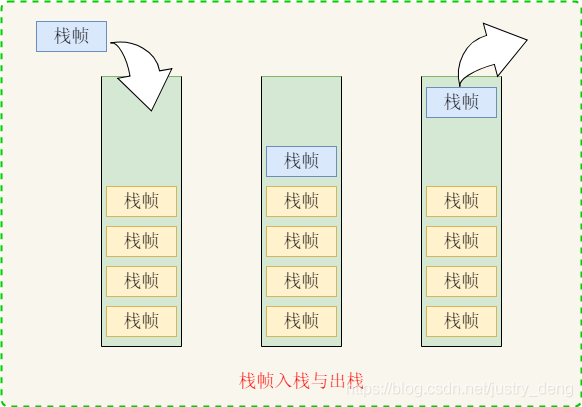
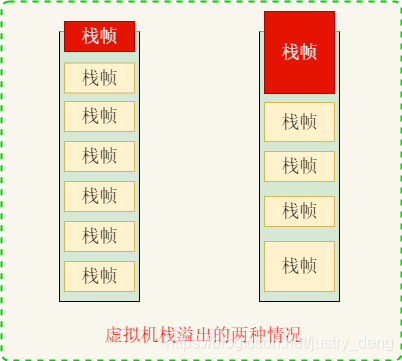
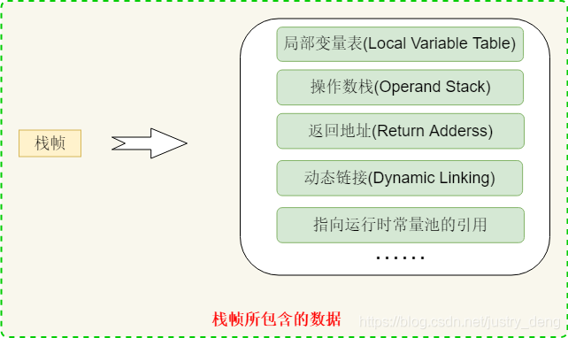

# JVM基础之栈、栈帧
[参考地址](https://blog.csdn.net/justry_deng/article/details/86761833)
## 栈

### 虚拟机栈

- **栈中保存的是一个又一个栈帧**

### 栈帧入栈与出栈

- 一个栈帧对应一个未运行完的函数；当某一个函数被调用一次时，就会产生一个栈帧(记录着该函数的相关信息)，并入栈;当该函数运行完毕之后，其对应的栈帧会出栈
- **函数的一次调用就会产生一个对应的栈帧，而不是一个函数本身对应一个栈帧**；如：递归调用就会产生无数个栈帧

### 栈的溢出

- 从栈的结构可知：如果栈帧数量过多(n多次调用方法)或某个(些)栈帧过大会导致栈溢出引发SOE(Stack Overflow Error)
- 如果允许虚拟机栈动态扩展，那么当内存不足时，会导致OOM(OutOfMemoryError)

## 栈帧

栈帧是用于支持虚拟机进行方法调用和方法执行的数据结构。它是虚拟机运行时数据区的虚拟机栈的组成元素。

- 注：调用一次方法(无论是不是调用的同一个方法)就会产生一个栈帧，可见上面介绍栈时给出的栈帧入栈出栈图

### 栈帧中主要包含的数据有
